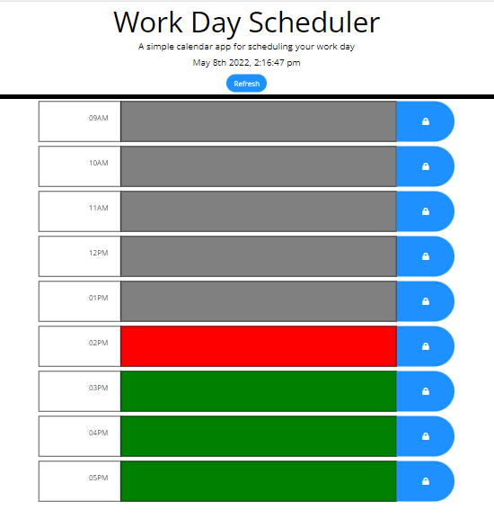

# w5-work-day-scheduler

# Description

When the application is opened it will display the current date and color the time selections for each time block from 9Am to 5PM. Depending on the current time the time blocks will be colored grey if time in the past, red if time is current and green if time in the future. The user can set an event description in the desired text area and press the blue button located at the right side of the corresponding text area. The description will be saved in local storage and rendered every time the application is opened.

## User Story

```md
AS AN employee with a busy schedule
I WANT to add important events to a daily planner
SO THAT I can manage my time effectively
```

## Acceptance Criteria

```md
GIVEN I am using a daily planner to create a schedule
WHEN I open the planner
THEN the current day is displayed at the top of the calendar
WHEN I scroll down
THEN I am presented with timeblocks for standard business hours
WHEN I view the timeblocks for that day
THEN each timeblock is color coded to indicate whether it is in the past, present, or future
WHEN I click into a timeblock
THEN I can enter an event
WHEN I click the save button for that timeblock
THEN the text for that event is saved in local storage
WHEN I refresh the page
THEN the saved events persist
```
## Deployed page

Link to the page: https://talexandru1987.github.io/work-day-scheduler/

Preview of the page:


